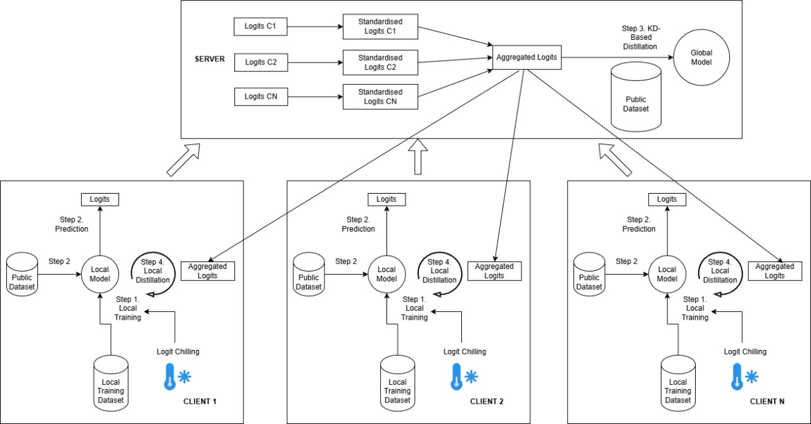
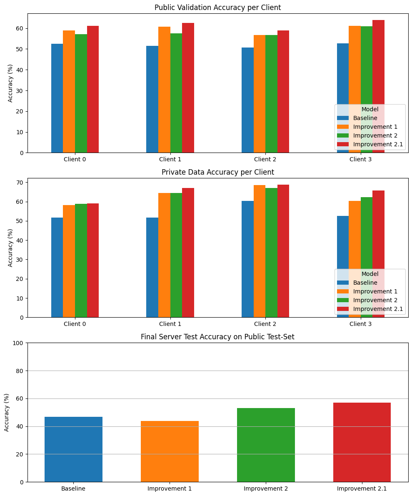

# HiPer-FedKD: Heterogeneity-aware Personalized Federated Knowledge Distillation

HiPer-FedKD is an advanced framework for federated learning that implements adaptive curriculum learning to dynamically adjust training difficulty based on client heterogeneity. The framework significantly improves model performance in non-i.i.d. (non-independent and identically distributed) federated learning environments through innovative knowledge distillation techniques.



## Table of Contents

- [Project Overview](#project-overview)
- [Repository Structure](#repository-structure)
- [Getting Started](#getting-started)
- [Key Innovations](#key-innovations)
  - [Personalized Logit Chilling](#personalized-logit-chilling)
  - [Logit Standardization](#logit-standardization)
  - [Exponential Temperature Scaling](#exponential-temperature-scaling)
- [Experimental Results](#experimental-results)
- [Citations](#citations)

## Project Overview

Federated Learning (FL) enables collaborative model training across decentralized devices while preserving data privacy. However, performance significantly degrades in environments with heterogeneous client data distributions (non-i.i.d. data). Furthermore, simple FL does not address the challenge of improving generalizability of both the client and the server models. HiPer-FedKD addresses this challenge through:

1. **Bidirectional Knowledge Distillation**: Facilitates knowledge exchange between clients and server
2. **Personalized Temperature Scaling**: Applies client-specific softmax temperatures based on data heterogeneity
3. **Logit Scale Standardization**: Aligns logit distributions to improve knowledge transfer

Our framework maintains client privacy while achieving substantially improved performance over standard federated learning approaches, particularly in extreme non-i.i.d. settings.


## Repository Structure

```
HiPer-FedKD/
├── README.md                                    # Project documentation
├── deliverables/
│   ├── Deliverable 2_Dataset Selection.ipynb    # Dataset selection and analysis
│   ├── Deliverable 3_Baseline Model.ipynb       # Initial baseline implementation
│   ├── Deliverable 4_Improvement 1.ipynb        # First model improvement
│   └── Deliverable 5_Improvement 2.ipynb        # Second model improvement
└── misc/
    ├── framework.jpg                            # Framework architecture visualization
    └── output.png                               # Experimental results visualization
```

## Getting Started

### Prerequisites

- Python 3.6+
- PyTorch
- torchvision
- numpy
- matplotlib
- pandas

### Running the Code

1. Clone this repository:
```bash
git clone https://github.com/yourusername/HiPer-FedKD.git
cd HiPer-FedKD
```

2. Install dependencies:
```bash
pip install torch torchvision numpy matplotlib pandas
```

3. Open and run the notebook:
```bash
jupyter notebook deliverables/Deliverable 5_Improvement 2.ipynb
```

The notebook contains implementations of:
- Baseline Federated Knowledge Distillation
- Model Improvement 1: Personalized Logit Chilling
- Model Improvement 2: Logit Standardization
- Model Improvement 2.1: Exponential Temperature Scaling

## Key Innovations

### Personalized Logit Chilling

In non-i.i.d. settings, clients with highly heterogeneous data struggle to learn effectively with standard temperature parameters. We introduce a novel approach that calculates client-specific temperatures based on their data heterogeneity:

```python
def calculate_client_temperature(client_distribution, global_distribution):
    score = calculate_heterogeneity_score(client_distribution, global_distribution)
    
    client_temp = 0.99 - 0.98 * score
    client_temp = max(client_temp, 0.05) #Lee et al do not drop T below 0.05
    return client_temp
```

By applying lower temperatures (closer to 0) for clients with higher heterogeneity scores, we sharpen their output distributions, amplifying confident predictions and enabling more effective representation learning.

### Logit Standardization

To address the scale mismatch problem during knowledge distillation, we implement logit standardization using Z-score normalization:

```python
def standardize_logits(logits: torch.Tensor, eps: float = 1e-6) -> torch.Tensor:
    mean = logits.mean(dim=-1, keepdim=True)
    std = logits.std(dim=-1, keepdim=True)
    return (logits - mean) / (std + eps)
```

This ensures that logits from different clients are on a consistent scale before aggregation, leading to more effective knowledge transfer and improved server model generalization.

### Exponential Temperature Scaling

Building on our personalized approach, we explored exponential temperature scaling that responds more aggressively to higher heterogeneity:

```python
def calculate_client_temperature_EXP(client_distribution, global_distribution):
    score = calculate_heterogeneity_score(client_distribution, global_distribution)
    client_temp = 0.99 * math.exp(-3 * score)  # Using k = 3
    client_temp = min(max(client_temp, 0.01), 0.99)
    return client_temp, score
```

This approach provides a more dramatic temperature reduction for clients with highly heterogeneous data, resulting in even sharper logits and improved learning for those clients.

## Experimental Results

Our experiments on the CIFAR-10 dataset demonstrate significant improvements over the baseline (at Dirichlet parameter setting = 1.0):

| Metric | Baseline Model | Improvement 1 | Improvement 2 | Improvement 2.1 |
|--------|---------------|---------------|---------------|-----------------|
| **Client 0 - Public Accuracy** | 52.58% | 58.96% | 57.16% | 61.16% |
| **Client 1 - Public Accuracy** | 51.46% | 60.68% | 57.60% | 62.50% |
| **Client 2 - Public Accuracy** | 50.74% | 56.74% | 56.66% | 58.96% |
| **Client 3 - Public Accuracy** | 52.64% | 61.08% | 61.00% | 63.92% |
| **Client 0 - Private Accuracy** | 51.71% | 58.11% | 58.90% | 59.11% |
| **Client 1 - Private Accuracy** | 51.69% | 64.41% | 64.46% | 67.17% |
| **Client 2 - Private Accuracy** | 60.29% | 68.51% | 66.99% | 68.75% |
| **Client 3 - Private Accuracy** | 52.63% | 60.38% | 62.41% | 65.67% |
| **Server Test Accuracy** | 46.75% | 43.88% | 53.20% | 56.99% |



Key observations:

1. **Improvement 1** (Personalized Logit Chilling): Significantly improved client local accuracies but resulted in a slight decrease in server accuracy.
2. **Improvement 2** (Logit Standardization): Successfully addressed the server accuracy degradation, achieving a 10% improvement over Improvement 1.
3. **Improvement 2.1** (Exponential Temperature Scaling): Further enhanced both client and server performance, achieving the best results across all metrics.

The combination of personalized logit chilling and standardized aggregation yields a robust framework for heterogeneous federated learning, achieving up to 10% improvement in server accuracy and up to 16% improvement in client accuracy compared to the baseline.

## Citations


- [Improving Local Training in Federated Learning via Temperature Scaling – Lee, Kim, and Ko](https://arxiv.org/pdf/2401.09986v2)

- [Distilling the Knowledge in a Neural Network – Hinton et al.](https://arxiv.org/pdf/1503.02531)

- [LTD: Low Temperature Distillation for Robust Adversarial Training – Chen et al.](https://arxiv.org/pdf/2111.02331)

- [FedBalancer: Data and Pace Control for Efficient Federated Learning on Heterogeneous Clients – Shin et al.](https://arxiv.org/abs/2201.01601)

- [Logit Standardization in Knowledge Distillation – Sun, Ren, Li, Wang, and Cao](https://arxiv.org/pdf/2403.01427)
